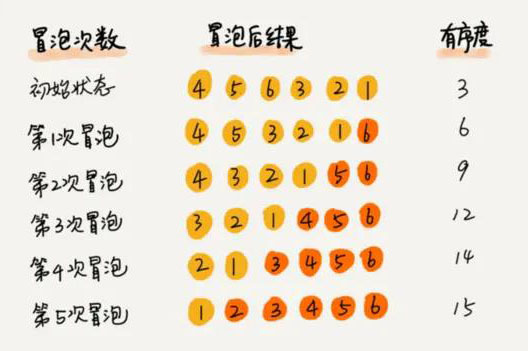

> 著名数据专家沃斯曾说：算法+数据结构=程序

## 排序
### 衡量排序算法好坏的三要素：

一、执行效率

- 最好时间复杂度
- 最坏时间复杂度
- 平均时间复杂度
- 时间复杂度的系数、常数 、低阶（因为排序的数据规模一般不会非常大）
- 比较、交换的次数

二、额外内存消耗（内存消耗为O(1)的称为原地排序）

三、稳定性，是否是稳定排序（即如果待排序的序列中存在值相等的元素，经过排序之后，相等元素之间原有的先后顺序不变）

### 按时间复杂度分类：
    
- O(n²)： 冒泡排序、插入排序、选择排序
- O(nlogn)：归并排序、快速排序
- O(n) ：桶排序、计数排序、基数排序 （条件苛刻，适用于部分场景）

#### 冒泡排序

原理： 从下往上，逐次比较两个相邻的数据，如果下面的数据比上面的数据大，则把这两个数据的位置互换。

- 最好时间复杂度 O(n)
- 最坏时间复杂度 O(n^2)
- 平均时间复杂度 O(n^2)
- 原地排序、稳定排序

#### 插入排序

原理： 分为已排区域和未排区域，每次拿未排区域中的第一个数，插入到已排区域中正确的位置。

- 最好时间复杂度 O(n)
- 最坏时间复杂度 O(n^2)
- 平均时间复杂度 O(n^2)
- 原地排序、稳定排序

#### 选择排序

原理： 分为已排区域和未排区域，每次从未排区域中选取最小的数，放到已排区域的最后面。

- 最好时间复杂度 O(n^2)
- 最坏时间复杂度 O(n^2)
- 平均时间复杂度 O(n^2)
- 原地排序、 非稳定的排序算法
- 一般都不考虑用该算法。

#### 归并排序

原理： 归并排序的核心思想还是蛮简单的。如果要排序一个数组，我们先把数组从中间分成前后两部分，然后对前后两部分分别排序，再将排好序的两部分合并在一起，这样整个数组就都有序了。

- 非原地排序，空间复杂度为O(n)
- 稳定排序
- 利用分治递归思想
- 递推公式： merge_sort(p…r) = merge(merge_sort(p…q), merge_sort(q+1…r))
- 最好、最坏、平均时间复杂度都是 O(nlogn)

#### 快速排序

- 原地排序
- 非稳定排序
- 递推公式： quick_sort(p…r) = partition(p…r) + quick_sort(p…q-1) + quick_sort(q+1, r)
- 最好时间复杂度: O(nlogn)
- 最坏时间复杂度: O(n^2) （极小几率出现）
- 平均时间复杂度: O(nlogn)

#### 桶排序
桶排序，顾名思义，会用到“桶”，核心思想是将要排序的数据分到几个有序的桶里，每个桶里的数据再单独进行排序。桶内排完序之后，再把每个桶里的数据按照顺序依次取出，组成的序列就是有序的了。

桶排序的时间复杂度为什么是 O(n) 呢？我们一块儿来分析一下。如果要排序的数据有 n 个，我们把它们均匀地划分到 m 个桶内，每个桶里就有 k=n/m 个元素。每个桶内部使用快速排序，时间复杂度为 O(k * logk)。m 个桶排序的时间复杂度就是 O(m * k * logk)，因为 k=n/m，所以整个桶排序的时间复杂度就是 O(n*log(n/m))。当桶的个数 m 接近数据个数 n 时，log(n/m) 就是一个非常小的常量，这个时候桶排序的时间复杂度接近 O(n)。

苛刻的条件：

1. 要排序的数据需要很容易就能划分成 m 个桶
2. 桶与桶之间有着天然的大小顺序
3. 数据在各个桶之间的分布是比较均匀的

#### 基数排序
我们再来看这样一个排序问题。假设我们有 10 万个手机号码，希望将这 10 万个手机号码从小到大排序，你有什么比较快速的排序方法呢？

我们之前讲的快排，时间复杂度可以做到 O(nlogn)，还有更高效的排序算法吗？桶排序、计数排序能派上用场吗？手机号码有 11 位，范围太大，显然不适合用这两种排序算法。针对这个排序问题，有没有时间复杂度是 O(n) 的算法呢？现在我就来介绍一种新的排序算法，基数排序。

刚刚这个问题里有这样的规律：假设要比较两个手机号码 a，b 的大小，如果在前面几位中，a 手机号码已经比 b 手机号码大了，那后面的几位就不用看了。

借助稳定排序算法，这里有一个巧妙的实现思路。还记得我们第 11 节中，在阐述排序算法的稳定性的时候举的订单的例子吗？我们这里也可以借助相同的处理思路，先按照最后一位来排序手机号码，然后，再按照倒数第二位重新排序，以此类推，最后按照第一位重新排序。经过 11 次排序之后，手机号码就都有序了。

手机号码稍微有点长，画图比较不容易看清楚，我用字符串排序的例子，画了一张基数排序的过程分解图，你可以看下。

注意，这里按照每位来排序的排序算法要是稳定的，否则这个实现思路就是不正确的。因为如果是非稳定排序算法，那最后一次排序只会考虑最高位的大小顺序，完全不管其他位的大小关系，那么低位的排序就完全没有意义了。

根据每一位来排序，我们可以用刚讲过的桶排序或者计数排序，它们的时间复杂度可以做到 O(n)。如果要排序的数据有 k 位，那我们就需要 k 次桶排序或者计数排序，总的时间复杂度是 O(k*n)。当 k 不大的时候，比如手机号码排序的例子，k 最大就是 11，所以基数排序的时间复杂度就近似于 O(n)。

实际上，有时候要排序的数据并不都是等长的，比如我们排序牛津字典中的 20 万个英文单词，最短的只有 1 个字母，最长的我特意去 查了下，有 45 个字母，中文翻译是尘肺病。对于这种不等长的数据，基数排序还适用吗？

实际上，我们可以把所有的单词补齐到相同长度，位数不够的可以在后面补“0”，因为根据ASCII 值，所有字母都大于“0”，所以补“0”不会影响到原有的大小顺序。这样就可以继续用基数排序了。

总结一下，基数排序对要排序的数据是有要求的：

1. 需要可以分割出独立的“位”来比较，而且位之间有递进的关系，如果 a 数据的高位比 b 数据大，那剩下的低位就不用比较了
2. 除此之外，每一位的数据范围不能太大，要可以用线性排序算法来排序，否则，基数排序的时间复杂度就无法做到 O(n) 了。

## 查找

#### 二分查找法

1. 依赖于数组结构（数据量太大不适合用二分查找法，数据需要连续的存储空间）
2. 数据必须是排好序的
3. 时间复杂度：O(logn)
